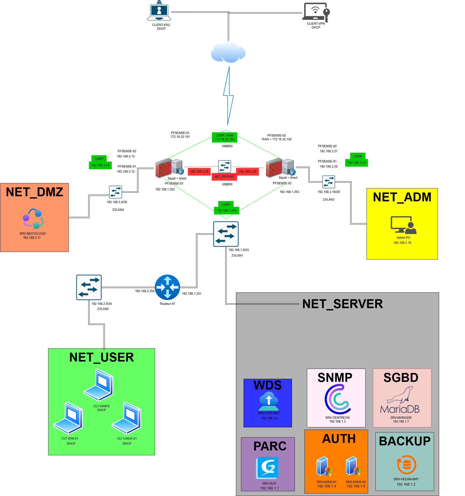
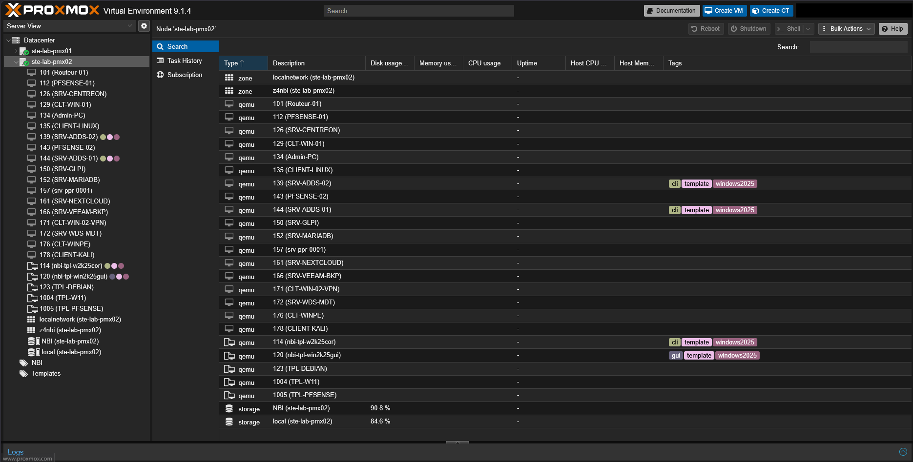
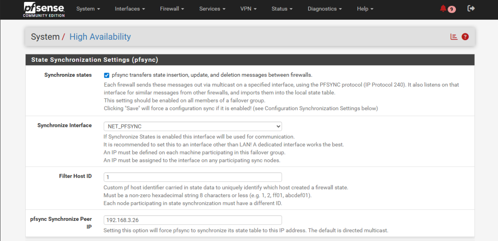

# 🏗 Infrastructure sécurisée haute disponibilité

Projet d’infrastructure sécurisée et hautement disponible, réalisé dans le cadre de mon BTS SIO option SISR.

L'objectif est de concevoir une architecture proche d'un environnement professionnel en intégrant la virtualisation, la segmentation réseau, la haute disponibilité, la supervision, les sauvegardes et plusieurs mécanismes de sécurité.

Ce projet me permet d'approfondir les domaines suivants :

- Administration systèmes Windows Server et Debian ;
- Virtualisation avec Proxmox ;
- Pare-feu et routage avec pfSense ;
- Active Directory, DNS et DHCP ;
- VPN et accès distants sécurisés ;
- Segmentation réseau ;
- Détection d'intrusion ;
- Supervision et surveillance ;
- Sauvegarde et continuité de service.
---

## Sommaire
- [Objectif](#objectif)
- [Technologies utilisées](#technologies-utilisees)
- [Architecture](#architecture)
- [Services déployés](#services-déployés)
- [Sécurité mise en œuvre](#sécurité-mise-en-œuvre)
- [Compétences développées](#compétences-développées)
- [Captures d'écran](#captures-ecran)
- [État du projet](#état-du-projet)

---

## 🎯 Objectif

Concevoir une infrastructure complète simulant un environnement professionnel avec :

- haute disponibilité ;
- segmentation réseau ;
- services Windows Server ;
- accès distant sécurisé ;
- supervision ;
- sauvegarde ;
- sécurité réseau.

---

## 🛠️ Technologies utilisées

- Proxmox
- pfSense
- CARP
- Active Directory / ADCS
- DNS / DHCP
- OpenVPN
- Snort
- Squid
- Centreon
- Veeam Backup
- Nextcloud
- WDS / MDT
- Windows Admin Center

---

## 🏗️ Architecture

L'infrastructure est basée sur un hyperviseur Proxmox hébergeant plusieurs machines virtuelles réparties dans différents réseaux segmentés.

L'objectif est de reproduire une infrastructure professionnelle intégrant :

- La haute disponibilité ;
- La segmentation réseau ;
- L'administration centralisée ;
- La supervision ;
- Les sauvegardes ;
- La sécurité des accès ;
- L'exposition contrôlée de services.

### Schéma d'architecture

### Principales caractéristiques

- Virtualisation avec Proxmox ;
- Haute disponibilité des pare-feux ;
- Segmentation réseau par sous-réseaux ;
- Administration centralisée via Active Directory ;
- VPN pour les accès distants sécurisés ;
- Détection d'intrusion ;
- Supervision de l'infrastructure ;
- Sauvegardes des services critiques ;
- Exposition contrôlée des services via une DMZ.

---

## 🖥️ Services déployés

L'infrastructure intègre plusieurs services permettant de garantir la disponibilité, la sécurité et l'administration centralisée du système d'information.

| Service | Technologie | Rôle |
|-----------|------------|------|
| Hyperviseur | Proxmox VE | Hébergement et gestion des machines virtuelles |
| Pare-feu | pfSense | Filtrage, routage et sécurisation des flux |
| Haute disponibilité | CARP | Continuité de service des pare-feux |
| Annuaire | Active Directory | Authentification centralisée des utilisateurs |
| Authorité de Certification | ADCS | Garantir l'authenticité des entités et garantir la confidentalité et l'intégrité des données échangées.
| DNS | Windows Server | Résolution de noms |
| DHCP | Windows Server | Attribution automatique des adresses IP |
| VPN | OpenVPN | Accès distant sécurisé |
| IDS / IPS | Snort | Détection et prévention des intrusions |
| Proxy | Squid | Contrôle et filtrage du trafic web |
| Supervision | Centreon | Surveillance de l'infrastructure |
| Sauvegarde | Veeam Backup | Protection et restauration des données |
| Service collaboratif | Nextcloud | Partage et stockage de fichiers |
| Déploiement | MDT / WDS | Installation automatisée des postes |
| Analyse réseau | Wireshark / Tcpdump | Analyse et diagnostic du trafic |
| Administration distante | Windows Admin Center / SSH / RSAT | Gestion des serveurs |
| DMZ | Réseau isolé | Hébergement des services exposés |

### Fonctionnalités mises en œuvre

✅ Haute disponibilité des pare-feux avec CARP

✅ Segmentation réseau

✅ Authentification centralisée avec Active Directory

✅ Services DNS et DHCP

✅ VPN sécurisé pour les accès distants

✅ Détection et prévention des intrusions

✅ Filtrage du trafic Web

✅ Supervision de l'infrastructure avec alertes

✅ Sauvegarde et restauration des services critiques

✅ Déploiement automatisé des postes Windows

✅ Exposition contrôlée de services en DMZ

✅ Analyse et diagnostic réseau

---

## 🔒 Sécurité mise en œuvre

Plusieurs mécanismes de sécurité ont été mis en place afin de garantir la confidentialité, l'intégrité et la disponibilité des services.

### 🛡️ Segmentation réseau

L'infrastructure est organisée en plusieurs sous-réseaux distincts afin de séparer les différents périmètres et de limiter les mouvements latéraux en cas de compromission.

Les différents réseaux permettent notamment de distinguer :

- le réseau utilisateurs ;
- le réseau serveurs ;
- le réseau d'administration ;
- la DMZ ;
- le réseau WAN.

Cette séparation améliore la sécurité globale de l'infrastructure et facilite le contrôle des communications entre les différents services. 

---
### 🔥 Pare-feu et haute disponibilité

Deux pare-feux pfSense fonctionnent en haute disponibilité grâce au protocole CARP, Les états de connexion sont égalements synchronisés entre les pare-feux grâce au protocole pfSync.

Cette architecture permet :

- d'assurer la continuité de service ;
- d'éviter un point de défaillance unique ;
- de maintenir la disponibilité du réseau en cas de panne d'un pare-feu.
---
### 🌐 Accès distants sécurisés

Les connexions externes sont sécurisées grâce à OpenVPN.

Les accès distants permettent :

- l'administration des équipements ;
- l'accès aux ressources internes ;
- la protection des communications via le chiffrement.
---
### 🚨 Détection et prévention des intrusions

Snort est utilisé afin d'analyser le trafic réseau et détecter d'éventuelles activités malveillantes.

Fonctions assurées :

- analyse des paquets ;
- détection des signatures connues ;
- génération d'alertes ;
- prévention des attaques.
---
### 🌍 Filtrage Web

Squid permet de contrôler les flux HTTP et HTTPS.

Objectifs :

- filtrer les accès ;
- contrôler la navigation ;
- renforcer la sécurité des utilisateurs.
---
### 📦 Sauvegarde et continuité de service

Veeam Backup assure la protection des machines virtuelles et des données critiques.

Les sauvegardes permettent :

- la restauration rapide des services ;
- la limitation des pertes de données ;
- l'amélioration de la continuité d'activité.
---
### 📊 Supervision et alertes

Centreon permet de surveiller l'état des équipements et des services.

La supervision permet :

- de détecter rapidement les incidents ;
- d'être alerté en cas d'anomalie ;
- de garantir la disponibilité de l'infrastructure.
---
### 🌐 DMZ

Les services exposés sont isolés dans une zone démilitarisée (DMZ).

Cette séparation permet :

- de limiter l'exposition du réseau interne ;
- d'améliorer la sécurité globale ;
- de contrôler les flux entre les différents réseaux.
---
### 🔍 Analyse réseau

Wireshark et Tcpdump sont utilisés pour :

- l'analyse des trames ;
- le diagnostic réseau ;
- la résolution d'incidents ;
- la compréhension des flux entre les équipements.

---

## 🧠 Compétences développées

Ce projet m'a permis de développer et d'approfondir plusieurs compétences dans les domaines des systèmes, des réseaux et de la cybersécurité.

| Domaine | Compétences acquises |
|-----------|-----------|
| 🖥️ Système | Installation et administration de Windows Server et Debian, Active Directory, DNS, DHCP, GPO |
| 🌐 Réseau | Plan d'adressage, routage, segmentation par sous-réseaux, règles de pare-feu, NAT |
| ☁️ Virtualisation | Déploiement et administration d'un environnement Proxmox |
| 🔥 Sécurité | pfSense, DMZ, OpenVPN, Snort, Squid, filtrage réseau, Certificat TLS |
| ♻️ Haute disponibilité | Mise en place de pfSense HA avec CARP |
| 📊 Supervision | Surveillance des équipements et services avec Centreon |
| 💾 Sauvegarde | Mise en œuvre de Veeam Backup et stratégies de restauration |
| 🚀 Déploiement | Déploiement automatisé de postes Windows avec MDT et WDS |
| 🔍 Diagnostic | Analyse du trafic réseau avec Wireshark et résolution d'incidents |
| 📚 Documentation | Réalisation de schémas, documentation technique et procédures d'administration |

### Objectifs pédagogiques

- Concevoir une infrastructure sécurisée proche d'un environnement professionnel ;
- Garantir la disponibilité des services ;
- Renforcer la sécurité du système d'information ;
- Développer des compétences en administration systèmes et réseaux ;
- Approfondir les concepts de cybersécurité et de continuité de service.

---

## 📸 Captures d'écran

### 🖥️ Proxmox

Hyperviseur de niveau 1 sur lequel repose mon infrastructure virtualisée.

---

### 🔥 Haute disponibilité des pare-feux pfSense avec CARP et PSYNC

L'infrastructure repose sur deux pare-feux pfSense configurés en haute disponibilité afin de garantir la continuité de service et d'éliminer les points de défaillance uniques.

**Description :**

Mise en place de plusieurs adresses IP virtuelles CARP associées aux différents sous-réseaux de l'infrastructure. Ces adresses sont utilisées comme passerelles par les équipements et permettent d'assurer une bascule transparente en cas de défaillance du pare-feu principal.

---

**Description :**

Le protocole pfsync permet de synchroniser dynamiquement les états des connexions entre les deux pare-feux. Ainsi, les sessions réseau en cours sont conservées lors d'une bascule, garantissant la continuité des communications.

**Description :**

La synchronisation XMLRPC permet de répliquer automatiquement les règles de pare-feu, les objets, les utilisateurs et la configuration entre les deux nœuds pfSense afin de maintenir une configuration cohérente sur l'ensemble du cluster.

**Description :**

Le premier pare-feu est actuellement actif et possède le rôle MASTER sur l'ensemble des adresses IP virtuelles CARP. Il assure le traitement du trafic de l'infrastructure.

**Description :**

Le second pare-feu est en attente dans le rôle BACKUP. En cas d'indisponibilité du nœud principal, il prend automatiquement le relais afin de garantir la disponibilité des services et des communications réseau.

---

### 👥 Active Directory

L'infrastructure intègre deux contrôleurs de domaine Windows Server pour la redondance assurant l'authentification centralisée ainsi que l'administration des utilisateurs, des groupes et des ressources du système d'information.

**Description :**

L'Active Directory a été structuré à l'aide d'Unités d'Organisation (OU) permettant de séparer les utilisateurs, les serveurs, les postes et les groupes. Cette organisation facilite l'administration, l'application des stratégies de groupe et la gestion des droits.

**Description :**

Plusieurs groupes de sécurité ont été créés afin de mettre en œuvre une gestion des autorisations basée sur les rôles. Cette approche permet de simplifier l'administration et d'appliquer le principe du moindre privilège.

**Description :**

Les utilisateurs autorisés à accéder aux services sont gérés au travers de groupes Active Directory dédiés. Cette méthode permet de centraliser les droits d'accès et de simplifier l'administration des différents services tels qu'OpenVPN, Nextcloud ou GLPI.

La méthode AGDLP est utilisée afin de bien structurer les droits d'accès et d'en faciliter la gestion sur la durée.

---

### 🌐 Accès distant sécurisé avec OpenVPN

L'infrastructure permet un accès distant sécurisé aux ressources internes grâce à OpenVPN. L'authentification des utilisateurs est centralisée via Active Directory et les communications sont chiffrées afin de garantir la confidentialité des échanges.

**Description :**

Les utilisateurs autorisés à se connecter au VPN sont regroupés dans un groupe de sécurité Active Directory dédié. Cette approche permet de centraliser et de simplifier la gestion des accès.

**Description :**

Déploiement d'un serveur OpenVPN en mode Remote Access (User Auth) permettant aux utilisateurs autorisés d'accéder aux ressources du réseau interne via un tunnel VPN sécurisé.

**Description :**

Une fois connecté au VPN, le poste client reçoit automatiquement une adresse IP appartenant au réseau privé du tunnel VPN. Les communications avec les ressources internes sont alors sécurisées grâce au chiffrement du trafic.

**Description :**

Le pare-feu pfSense permet de superviser en temps réel les utilisateurs connectés au serveur OpenVPN ainsi que leur adresse virtuelle, le volume de données échangées et les algorithmes de chiffrement utilisés.

---

### 🚨 Détection d'intrusion avec Snort

L'infrastructure intègre Snort afin d'assurer la détection des activités suspectes et de renforcer la sécurité du système d'information.

**Description :**

Snort a été déployé sur l'interface WAN du pare-feu pfSense afin d'analyser le trafic entrant et de détecter les activités malveillantes grâce à des signatures de sécurité.

**Description :**

Un scan de ports a été réalisé à l'aide de Nmap depuis une machine Linux afin de simuler une activité de reconnaissance réseau et de vérifier le bon fonctionnement du système de détection d'intrusion.

**Description :**

Snort a correctement détecté l'activité de reconnaissance effectuée à l'aide de Nmap et a généré une alerte de sécurité indiquant une tentative de scan de ports.

Cette détection permet d'identifier rapidement des comportements potentiellement malveillants et de renforcer la surveillance du réseau.

---
### 📊 Supervision de l'infrastructure avec Centreon

L'infrastructure intègre Centreon afin de superviser en temps réel les équipements, les services et les performances des différents serveurs. Cette supervision permet de détecter rapidement les anomalies et de garantir la disponibilité des services.

**Description :**

Centreon permet de surveiller l'état des différents équipements de l'infrastructure. Les contrôleurs de domaine, les pare-feux, les serveurs applicatifs et les services critiques sont supervisés en permanence afin de garantir leur disponibilité.

**Description :**

Les services essentiels de l'infrastructure sont surveillés en continu, notamment :

- Active Directory ;
- Veeam Backup ;
- MariaDB ;
- pfSense ;
- NTP ;
- Services Windows.

Cette supervision permet de détecter rapidement les défaillances et d'améliorer la disponibilité du système d'information.

**Description :**

Le tableau de bord Centreon permet de visualiser l'utilisation des ressources des différents serveurs, notamment :

- l'utilisation du processeur ;
- l'utilisation de la mémoire ;
- les performances globales de l'infrastructure.

Cette supervision facilite l'analyse des performances et l'identification des anomalies potentielles.

---
### 💾 Sauvegarde et continuité de service avec Veeam Backup

L'infrastructure intègre Veeam Backup afin de protéger les serveurs critiques et d'assurer la continuité de service en cas d'incident ou de perte de données.

**Description :**

Veeam Backup est utilisé pour protéger les contrôleurs de domaine Active Directory de l'infrastructure. Les sauvegardes permettent de restaurer rapidement les services critiques en cas de défaillance ou de corruption des données.

Les opérations de sauvegarde sont réalisées automatiquement et les résultats sont surveillés afin de garantir leur bon déroulement.

**Description :**

L'infrastructure intègre également la sauvegarde des serveurs Linux, notamment les services hébergeant les applications exposées. Cette stratégie permet d'assurer la disponibilité des données et de limiter les pertes en cas d'incident.

Les sauvegardes sont effectuées avec l'agent Veeam Linux et leur état est supervisé afin de garantir leur réussite.

---
### ☁️ Service collaboratif Nextcloud

L'infrastructure intègre un serveur Nextcloud hébergé dans une DMZ afin de proposer un service de stockage et de partage de fichiers accessible de manière sécurisée.

**Description :**

Nextcloud fournit une interface web permettant aux utilisateurs d'accéder à leurs fichiers et de bénéficier de fonctionnalités collaboratives similaires à celles des solutions de stockage cloud professionnelles.

**Description :**

Les utilisateurs peuvent stocker, organiser et partager leurs données au sein de l'infrastructure. Cette solution facilite la collaboration tout en conservant le contrôle des données au sein du système d'information.

**Description :**

Nextcloud est intégré à Active Directory au moyen du protocole LDAPS (LDAP sécurisé). Cette configuration permet aux utilisateurs du domaine de s'authentifier directement avec leurs identifiants Windows tout en assurant le chiffrement des échanges.

**Description :**

Le service Nextcloud est protégé par un certificat SSL/TLS permettant d'assurer la confidentialité et l'intégrité des communications entre les utilisateurs et le serveur.

Les échanges sont chiffrés et le certificat est reconnu comme valide au sein de l'infrastructure.

---

### 🚦 Filtrage des flux et règles de sécurité avec pfSense

L'infrastructure s'appuie sur pfSense afin d'assurer le routage, la segmentation des réseaux et le contrôle des communications entre les différents services.

**Description :**

Le pare-feu pfSense assure la traduction d'adresses (NAT) des différents sous-réseaux de l'infrastructure vers le réseau WAN.

Les réseaux internes sont regroupés à l'aide d'alias afin de simplifier l'administration et la gestion des règles.

**Description :**

Des règles de pare-feu spécifiques ont été mises en place afin de contrôler les communications entre les différents sous-réseaux.

**Description :**

Une règle spécifique sur l'interface WAN permet d'autoriser les connexions au serveur OpenVPN.

Les utilisateurs externes peuvent ainsi accéder de manière sécurisée aux ressources internes au travers d'un tunnel VPN chiffré.

---
### 📡 Analyse réseau avec Wireshark

Wireshark est utilisé afin d'observer et d'analyser les échanges réseau. Cet outil permet de comprendre le fonctionnement des protocoles et de diagnostiquer d'éventuels problèmes de communication.

**Description :**

Une requête DNS a été générée à l'aide de la commande :

"nslookup google.fr"

---
### 🖥️ Déploiement automatisé des postes avec MDT / WDS

L'infrastructure intègre Microsoft Deployment Toolkit (MDT) afin d'automatiser le déploiement des systèmes d'exploitation et des applications, tout en garantissant la standardisation des postes de travail.

**Description :**

Plusieurs images Windows ont été intégrées au Deployment Share afin de permettre le déploiement automatisé des postes clients et des serveurs.

**Description :**

Les applications nécessaires aux postes utilisateurs sont intégrées directement au Deployment Share afin d'automatiser leur installation lors du déploiement.

Cette approche permet d'assurer une homogénéité des postes et de réduire le temps nécessaire à leur préparation.

Les séquences de tâches permettent d'automatiser l'ensemble du processus d'installation :

- déploiement du système d'exploitation ;
- installation des applications ;
- mises à jour ;
- configuration du poste ;
- restauration de l'état utilisateur ;
- activation de BitLocker.

Cette automatisation permet de réduire les interventions manuelles et de garantir des déploiements reproductibles.

---
## 🚀 État du projet                                         

Le projet est en cours de documentation.

